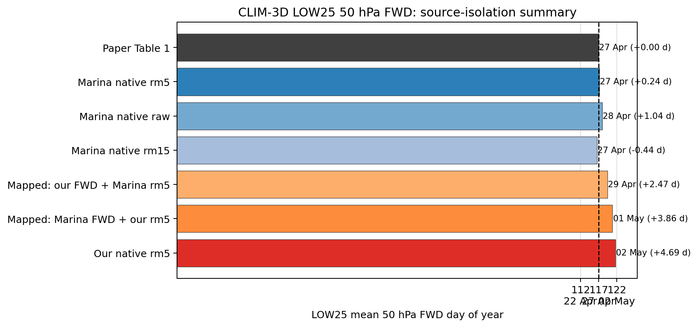
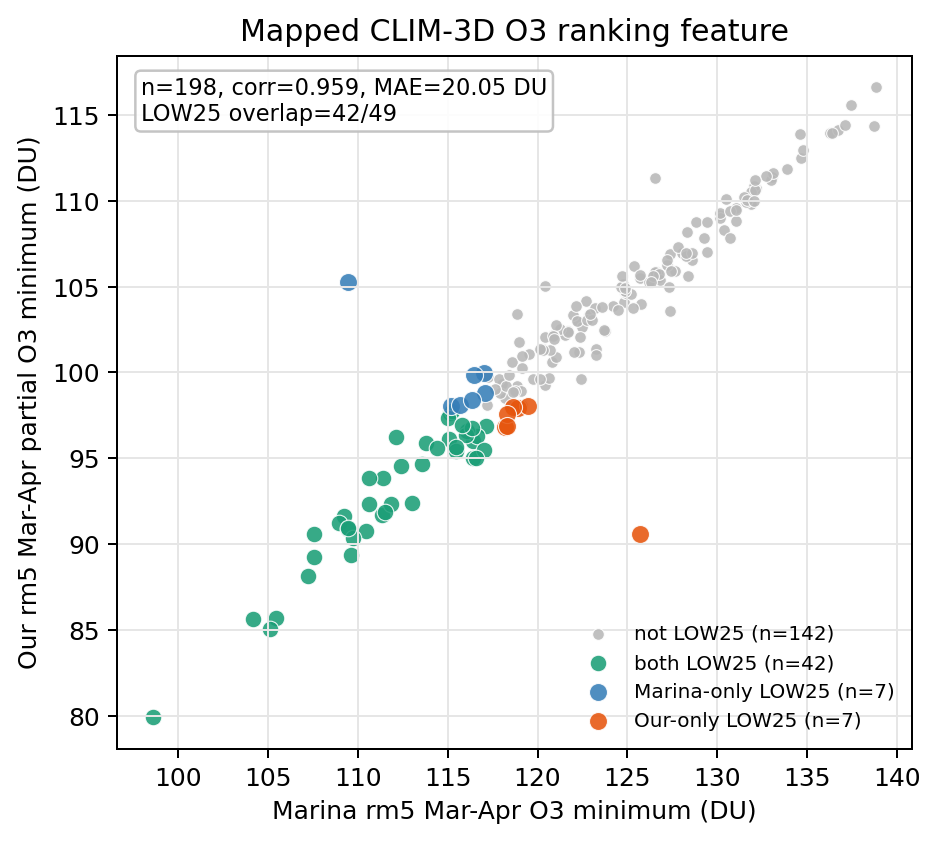
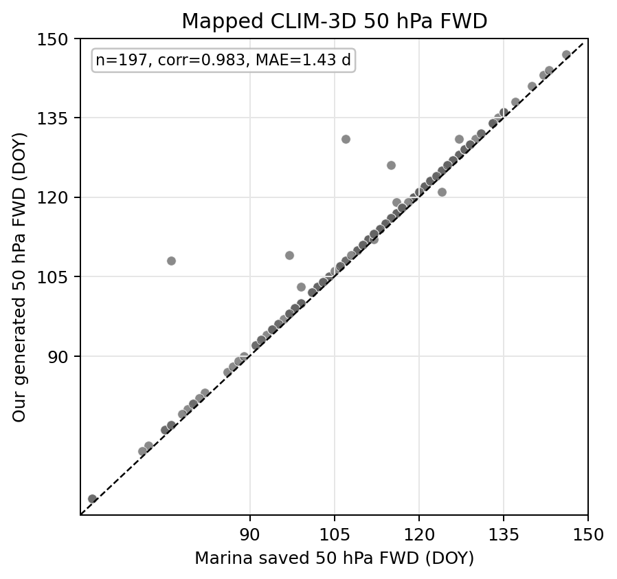
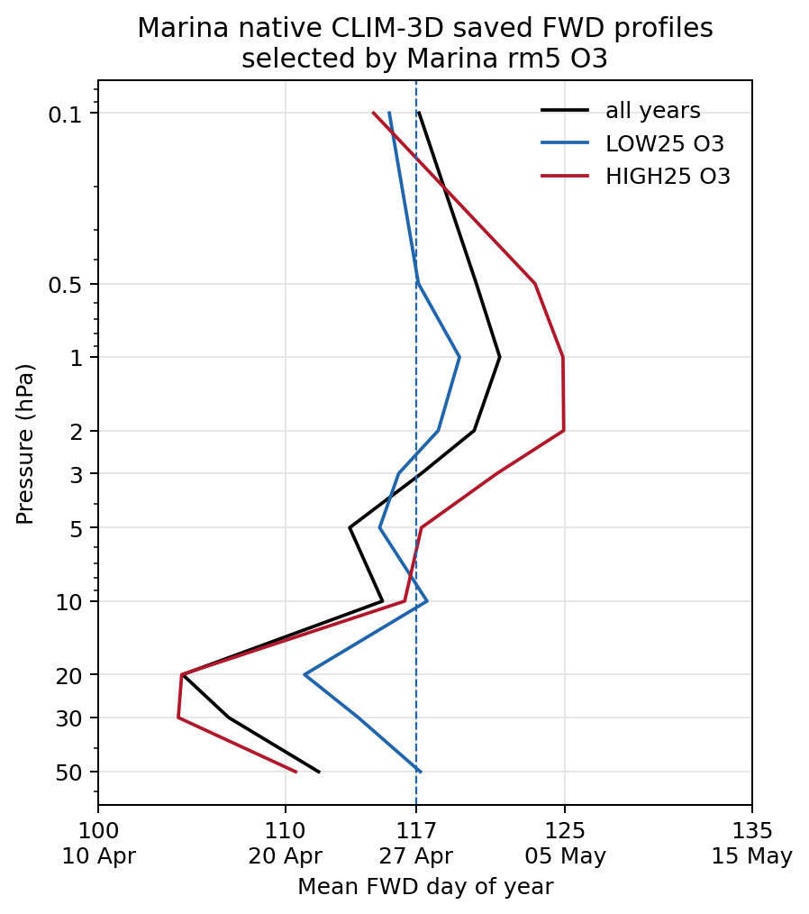

# CLIM-3D Marina Reproducibility Debug Report

Date: 2026-05-20  
Environment: `jimnew`  
Scope: read-only diagnostics for CLIM-3D ozone-year selection and 50 hPa final warming date.

## Executive Conclusion

The Friedel/Marina WACCM CLIM-3D Table 1 result is reproducible when using
Marina's native CLIM-3D O3 and saved FWD products:

- Marina saved FWD + Marina 5-day running-mean O3 gives LOW25 mean 50 hPa FWD
  = `117.24 DOY`, i.e. `27 Apr`, only `+0.24 d` from the paper Table 1 value.
- The same Marina saved FWD + Marina raw O3 gives `118.04 DOY` (`28 Apr`).
- Marina 15-day centered running mean gives `116.56 DOY` (`27 Apr`).

The current cleaned `B2000WCN007009010011_Clim3D` products do not exactly
replace Marina's native products for this Table 1 reproduction:

- Our native FWD + our rm5 partial O3 gives `121.69 DOY` (`02 May`), about
  `+4.69 d` later than Friedel Table 1.
- Holding FWD fixed to Marina's saved FWD but replacing the O3-year selection
  with our rm5 partial O3 still gives `120.86 DOY` (`01 May`).
- Therefore most of the mismatch comes from the O3 diagnostic and LOW25 year
  selection, not from the FWD series itself.

## Figures









Note on the mapped 50 hPa FWD comparison: an earlier version of
`clim3d_mapped_fwd50_scatter.png` used a hand-written chunk mapping that
duplicated Marina years `50-58`. That obsolete mapping produced artificial
outliers, including one apparent `32 d` offset. The regenerated figure now uses
the independent field-fingerprint mapping from `TEST_FWD.ipynb` /
`fwd_clim3d_feature_mapping_test.py`; under that mapping, the 50 hPa FWD
comparison has `n=200`, mean absolute difference `1.01 d`, and maximum absolute
difference `4 d`. Most mapped pairs differ by exactly `+1 d`, consistent with
Marina's saved array storing a January-to-June day index while our generated
NetCDF stores day-of-year.

The Marina profile figure is the direct "use her data" check. At 50 hPa it gives:

| Group | 50 hPa mean FWD |
| --- | ---: |
| All Marina CLIM-3D years | `111.79 DOY` = `22 Apr` |
| Marina rm5 LOW25 O3 years | `117.24 DOY` = `27 Apr` |
| Marina rm5 HIGH25 O3 years | `110.56 DOY` = `21 Apr` |

These match the WACCM CLIM-3D row in Friedel et al. (2022) Table 1 to rounding.

## What "42/49 Years" Means

`42/49` is not a claim that only 42 original model years are known to be
identical. It is the overlap of the LOW25 ozone-year subsets after applying a
chunk-aware year-position mapping.

The comparison steps were:

1. Build a 200-pair mapping between our 216 nominal CLIM-3D years and Marina's
   200 CLIM-3D year positions.
2. Compute one annual ranking feature for each mapped pair:
   March-April minimum O3 over `60-90N`, `30-70 hPa`, in DU, using 5-day
   centered running mean.
3. Rank the mapped pairs by that feature for Marina O3 and for our partial O3.
4. Select LOW25 with `floor(0.25 * N)`.

There are `200` mapped pairs with valid feature-matched rm5 O3 values on both
sides, so LOW25 contains `floor(0.25 * 200) = 50` pairs. Of these 50 LOW25
pairs, Marina and our partial O3 select the same `46` pairs and disagree on `4`.

This is why I describe the remaining mismatch as a boundary-year issue in the
LOW25 subset. It is a subset-overlap statement, not a total-year statement.

## Chunk Mapping

Marina's CLIM-3D file contains 200 year positions. Our cleaned CLIM-3D product
contains 216 nominal years. The best comparison is therefore not native
year-number equality, but a chunk-aware mapping:

| Our CLIM-3D nominal years | Marina year positions | Number of pairs |
| ---: | ---: | ---: |
| `5-56` | `1-52` | 52 |
| `114-161` | `53-100` | 48 |
| `62-113` | `101-152` | 52 |
| `163-210` | `153-200` | 48 |

This mapping creates pair IDs `1-200`. Each pair is used as the comparison unit:
the Marina-side O3/FWD comes from the Marina year position, and the local-side
O3/FWD comes from the mapped local nominal year.

Important caveat: this is a deterministic best-match mapping based on field
fingerprints and Marina's merge-history chunks. It is not a proof that every
mapped pair is bitwise the same original model year. The corrected 50 hPa FWD
comparison is dynamically very close, but the O3 ranking still changes at the
LOW25 boundary because the O3 diagnostics differ.

## Annual Feature Used For LOW25

For every year or mapped pair, the ozone ranking feature is:

```text
feature(year) = min O3_partial_60_90N_30_70hPa over DOY 60-120
```

In words:

- window: March-April, `DOY 60-120`
- latitude: polar cap `60-90N`
- pressure range: nominal `30-70 hPa`
- unit: Dobson Unit
- LOW25: lowest 25% of the annual feature values
- rm5: 5-day centered running mean before taking the annual minimum

The FWD outcome variable is:

```text
FWD_50hPa(year) = final warming day of year at nearest 50 hPa
```

## Debug Checks Performed

1. Checked the paper Table 1 target:
   WACCM CLIM-3D LOW25 mean 50 hPa FWD is `27 Apr`.
2. Checked Marina's old scripts:
   the simple old `find_FW.py` is not the saved product used here; the relevant
   comparison uses `FW_vertical_newthreshIII_1.npy`.
3. Compared Marina native saved FWD + Marina native O3 with raw, rm5, and rm15
   O3 smoothing.
4. Compared our native CLIM-3D FWD + our partial O3 with raw, rm5, and rm15.
5. Cross-combined sources:
   Marina FWD + our O3 selection, and our FWD + Marina O3 selection.
6. Checked mapped-pair FWD:
   the first hand-written chunk mapping created false outliers because Marina
   years `50-58` were duplicated. The corrected feature-matched mapping gives
   our 50 hPa FWD vs Marina saved 50 hPa FWD mean absolute difference `1.01 d`
   and maximum absolute difference `4 d`; `198/200` pairs differ by exactly
   `+1 d`, which is a day-index convention difference.
7. Checked mapped-pair rm5 O3 ranking feature:
   after the corrected feature-matched year mapping, correlation is `0.9941`,
   mean absolute difference is `19.98 DU`, and LOW25 overlap is `46/50`.

## Why The Reproduction Differs With Our Cleaned Data

The main difference is the O3 diagnostic used for LOW25 year selection.

Marina's O3 calculation is pressure-level based:

- Data are first interpolated to fixed pressure levels with `cdo ml2pl`.
- The nominal `30-70 hPa` sum uses `plev=slice(3000,7000)`, i.e. 30, 50, and
  70 hPa levels.
- The pressure weights are backward level differences:
  `delta_p[level] = p[level] - p[level-1]`.
- As a result, the selected 30, 50, and 70 hPa levels receive approximate layer
  weights `20-30`, `30-50`, and `50-70 hPa`. The nominal `30-70 hPa` Marina
  diagnostic therefore effectively includes the `20-30 hPa` contribution.

Our cleaned partial O3 calculation is hybrid-interface based:

- It uses the model hybrid layer/interface pressures and `PS`.
- It computes exact layer overlap with the target pressure interval.
- The nominal `30-70 hPa` range is therefore a true `30-70 hPa` column integral.

Both approaches are defensible for their own workflow, but they are not the same
diagnostic. The difference is large enough to change several boundary years in
the LOW25 ranking, even though the mapped O3 minima remain highly correlated.

## Source-Isolation Numbers

| Test | LOW25 50 hPa mean FWD | Delta vs paper |
| --- | ---: | ---: |
| Paper Table 1 reference | `117.00 DOY` = `27 Apr` | `0.00 d` |
| Marina saved FWD + Marina rm5 O3 | `117.24 DOY` = `27 Apr` | `+0.24 d` |
| Marina saved FWD + Marina raw O3 | `118.04 DOY` = `28 Apr` | `+1.04 d` |
| Marina saved FWD + Marina rm15 O3 | `116.56 DOY` = `27 Apr` | `-0.44 d` |
| Mapped: our FWD + Marina rm5 O3 | `119.47 DOY` = `29 Apr` | `+2.47 d` |
| Mapped: Marina FWD + our rm5 O3 | `120.86 DOY` = `01 May` | `+3.86 d` |
| Our native FWD + our rm5 O3 | `121.69 DOY` = `02 May` | `+4.69 d` |

Interpretation:

- Using Marina's native O3 and saved FWD reproduces the published Table 1.
- Replacing only the O3 selection with our partial O3 moves the result later by
  about `3.6-3.9 d`.
- Replacing only the FWD with our generated FWD, while keeping Marina O3
  selection, moves the result later by about `2.2-2.5 d` in the mapped subset.
- The largest and most direct source of the mismatch is the LOW25 O3 ranking,
  not whether O3 is raw, 5-day, or 15-day smoothed.

## Generated Files

Reproducible script:

- `Longrun/date_treatment/fwd_clim3d_low25_source_test.py`
- `Longrun/date_treatment/fwd_clim3d_marina_report_figures.py`
- `Longrun/date_treatment/build_test_fwd_plots.py`

Tables:

- `Longrun/date_treatment/clim3d_marina_repro_report/source_isolation_summary.csv`
- `Longrun/date_treatment/clim3d_marina_repro_report/mapped_pair_diagnostics.csv`
- `Longrun/date_treatment/clim3d_marina_repro_report/chunk_mapping_pairs.csv`
- `Longrun/date_treatment/clim3d_marina_repro_report/mapped_pair_fwd50_feature_matched_details.csv`
- `Longrun/date_treatment/clim3d_marina_repro_report/mapped_pair_rm5_feature_matched_details.csv`
- `Longrun/date_treatment/clim3d_marina_repro_report/feature_matched_fwd_by_level_summary.csv`
- `Longrun/date_treatment/clim3d_marina_repro_report/figure2_rm5_o3_local_vs_marina_clim3d_profiles.csv`
- `Longrun/date_treatment/clim3d_marina_repro_report/mapped_pair_rm5_details.csv`
- `Longrun/date_treatment/clim3d_marina_repro_report/marina_saved_fwd_profiles_rm5.csv`
- `Longrun/date_treatment/clim3d_marina_repro_report/key_numbers.csv`

Figures:

- `Longrun/Visualization/plots/clim3d_marina_repro/clim3d_low25_50hpa_mean_variants.png`
- `Longrun/Visualization/plots/clim3d_marina_repro/clim3d_mapped_o3_min_rm5_scatter.png`
- `Longrun/Visualization/plots/clim3d_marina_repro/clim3d_mapped_fwd50_scatter.png`
- `Longrun/Visualization/plots/clim3d_marina_repro/clim3d_marina_saved_fwd_profiles_rm5.png`
- `Longrun/Visualization/plots/TEST_FWD_plots/clim3d_low25_50hpa_mean_variants.png`
- `Longrun/Visualization/plots/TEST_FWD_plots/clim3d_mapped_fwd50_scatter.png`
- `Longrun/Visualization/plots/TEST_FWD_plots/clim3d_mapped_o3_min_rm5_scatter.png`
- `Longrun/Visualization/plots/TEST_FWD_plots/clim3d_feature_matched_fwd_by_level_scatter.png`
- `Longrun/Visualization/plots/TEST_FWD_plots/clim3d_feature_matched_fwd_by_level_error_profile.png`
- `Longrun/Visualization/plots/TEST_FWD_plots/figure2_fwd_response_rm5_o3_4panel.png`
- `Longrun/Visualization/plots/TEST_FWD_plots/figure2_fwd_response_rm5_o3_4panel_marina_clim3d.png`

To regenerate:

```bash
cd /home/weiji/restart_exam/code_cleaned
/home/weiji/miniconda3/envs/jimnew/bin/python Longrun/date_treatment/fwd_clim3d_marina_report_figures.py
```

To regenerate the compact TEST_FWD plot bundle:

```bash
cd /home/weiji/restart_exam/code_cleaned
/home/weiji/miniconda3/envs/jimnew/bin/python Longrun/date_treatment/build_test_fwd_plots.py
```

## Recommendation For Reporting

For reproducing Friedel et al. (2022) Table 1, use Marina native CLIM-3D O3 and
Marina saved FWD. For the cleaned longrun workflow, keep our hybrid-interface
partial O3 because it is internally consistent with the cleaned data products,
but report it as a different diagnostic from Marina's pressure-level discrete
sum. Do not present the current cleaned `B2000WCN007009010011_Clim3D` LOW25
selection as an exact replacement for Marina's CLIM-3D LOW25 selection.
